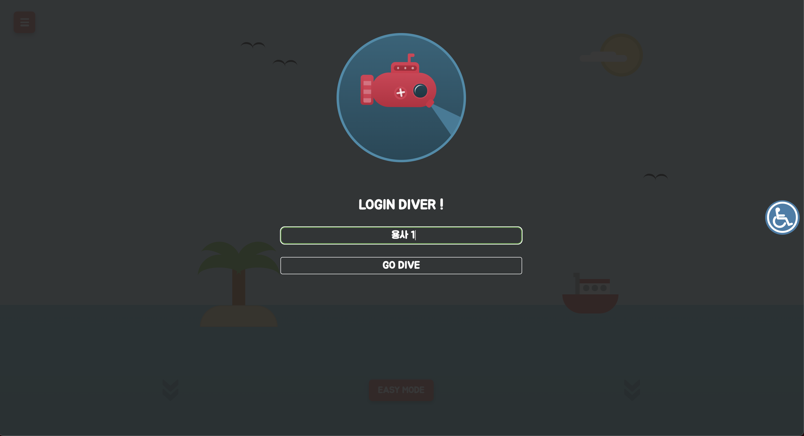
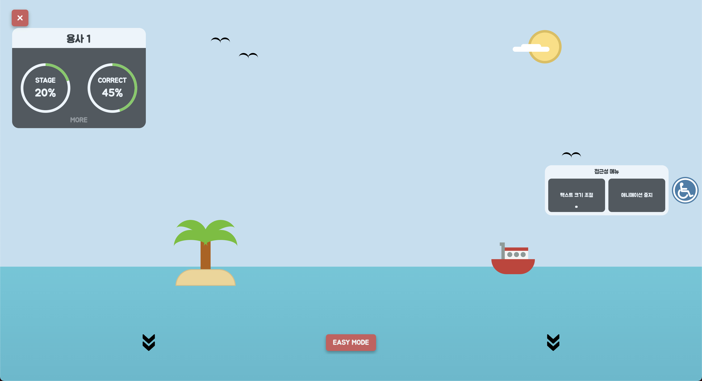
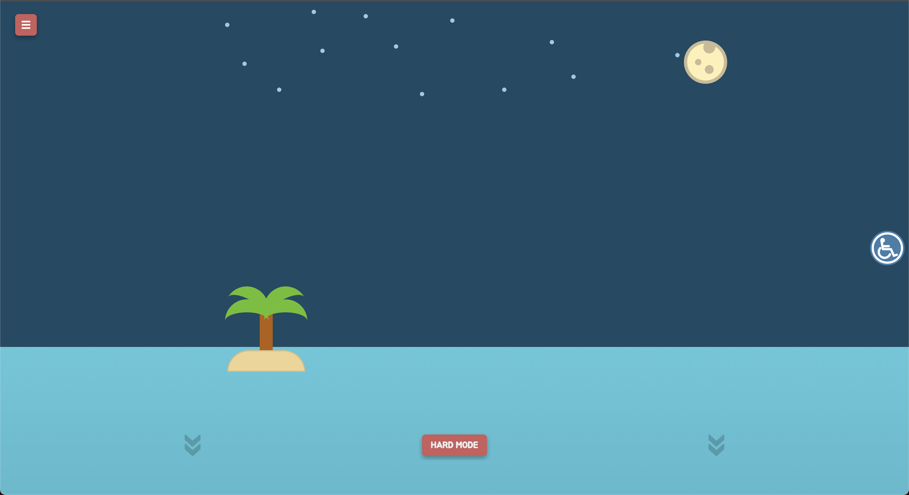
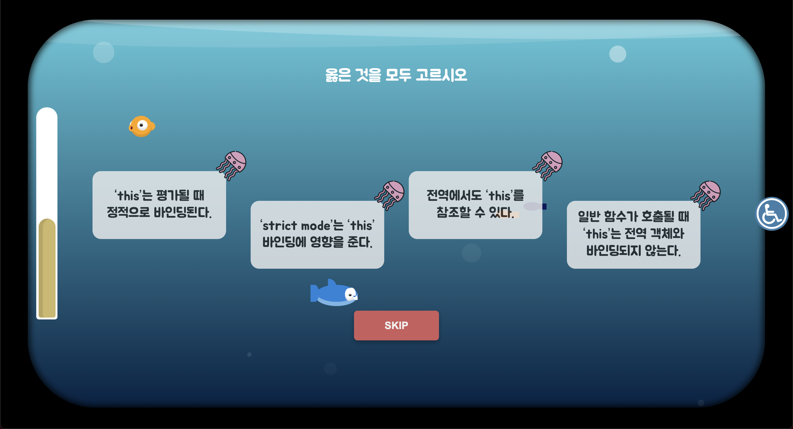
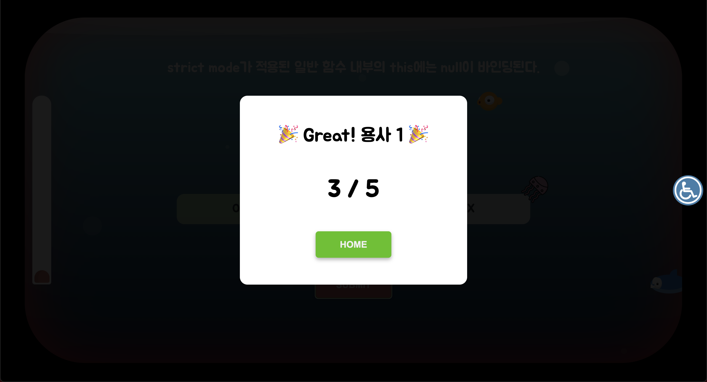
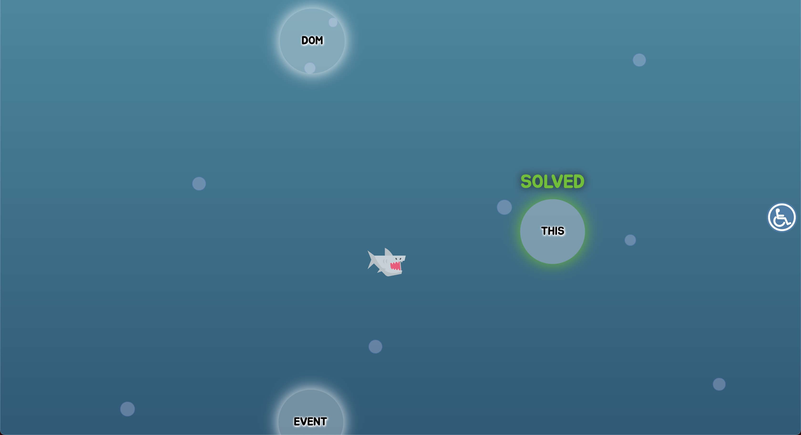

# JS-Learner 
## :fire: Single File Challenge: 단 하나의 app.js로 SPA 따라해보기 :fire:

게임으로 배우는 JavaScript Deep Dive.

## 1. Overview

### 1.1 초기 화면

  
  
  

### 1.2 게임 화면

  
  
  

## 2. Detail

### 2.1 Pure Javascript

- No Framework
- SPA 구현
- Code 모듈화

### 2.2 접근성

- 웹 접근성을 고려한 버튼 컨트롤러
  - 텍스트 크기
  - 애니메이션 종료 (거품 애니메이션, 물고기 이동 애니메이션 등)

### 2.3 사용자

- 서버 대신 localStorage에 username만 저장
- 저장된 사용자가 없을 경우에만 로그인 진행
- 사용자 게임 진행 상황, 정답률 등 시각화 (도넛 차트 svg)

### 2.4 게임

- 문제 카테고리별 게임 진행
- 난이도 설정 (Easy/Hard 모드)
- 게임 시작 시 loading 애니메이션 적용